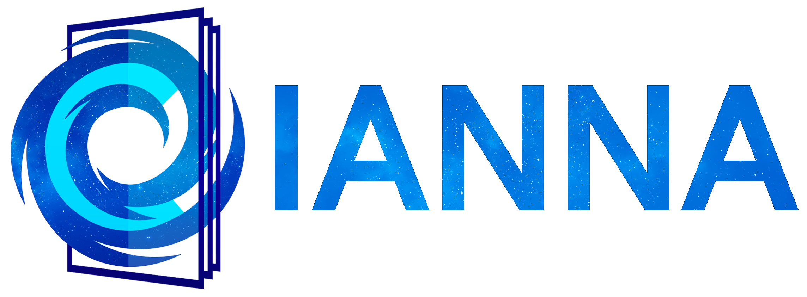

<p align="center">

</p>
   
*Logo made by &copy; Sarah E. Anderson*

## CIANNA - Convolutional Interactive Artificial Neural Networks by/for Astrophysicists

CIANNA - Convolutional Interactive Artificial Neural Networks by/for Astrophysicists - is a general-purpose deep learning framework, but is mainly developed and used for astrophysical applications. Functionalities and optimizations are added based on relevance for (our subset of) astrophysical problem-solving.

Developer : [David Cornu](https://vm-weblerma.obspm.fr/dcornu/), FR - LERMA / Observatoire de Paris, PSL
david.cornu@observatoiredeparis.psl.eu

See Copyright &copy; and [License](#License) terms at the end.


&nbsp;

## /!\ /!\ /!\ WARNING /!\ /!\ /!\

CIANNA is a fast-evolving framework that adds new capabilities, methods, architectures, and optimizations over time and accounts for new AI-dedicated technologies. The framework itself and the associated interface are subject to significant changes between versions (no guaranteed forward or backward compatibility). One must pay attention to what has been changed before performing updates (the [patch note file](https://github.com/Deyht/CIANNA/blob/CIANNA_dev/patch_note.txt) keeps track of the significants modifications).

**SKA Science Data Challenge 2 information** ([SDC2](https://sdc2.astronomers.skatelescope.org/)): *The current dev branch of CIANNA includes the work that was done by the [MINERVA](https://vm-weblerma.obspm.fr/minerva/ska-data-challenges/) team of implementing a 3D-YOLO network in the context of the SKA-SDC2. However, this is **not** a participation to the SDC2 reproducibility award and does not contain the actual training procedure we used for the challenge. This last point will come in the near-future along with papers dedicated to our approach. Still, the present CIANNA_dev contains all the necessary functions to construct a 3D-YOLO network, see the Google Colab example below.*

&nbsp;

## How to use

Please read the [How to use](https://github.com/Deyht/CIANNA/wiki/3\)-How-to-use-(Python-interface)) Wiki page for a minimalistic tour of CIANNA capabilities on a simple example script and dataset. The Wiki page containing all the interface functions details is under construction. You might also want to consult the Step-by-step installation guide to verify that everything was correctly installed.  
"Troubleshooting" and "F.A.Q" pages will be added soon.

**For a quick view of CIANNA capabilities using Goggle Colab:**  

- Simple MNIST example script  
[](https://colab.research.google.com/github/Deyht/CIANNA/blob/CIANNA_dev/ex_script.ipynb)  

- More advanced YOLO detection network on the PASCAL-VOC dataset (from [IRMIA 2022](https://github.com/Deyht/IRMIA_2022) summer school)  
[](https://colab.research.google.com/github/Deyht/IRMIA_2022/blob/main/IRMIA_DL_Summer_school_2022_Object_Detection_with_YOLO_full_v2.ipynb)  

&nbsp;

## Installation

#### 

A full **step-by-step installation guide** of CIANNA and its dependencies from a fresh Ubuntu 20.04 is accessible [here](https://github.com/Deyht/CIANNA/wiki/Step-by-step-installation-guide-\(Ubuntu-20.04\)).

#### Dependencies

CIANNA is codded in C99 and requires at least a C compiler. Additionally, it supports several compute methods:
- **C_NAIV**: No dependency, straightforward CPU implementation (mainly for pedagogical purposes). Support basic multi-CPU with OpenMP.
- **C_BLAS**: Require [OpenBLAS](https://github.com/xianyi/OpenBLAS), much more optimized multi-CPU implementation. Non-matrix operations can also be multi-threaded with OpenMP. An OpenMP installation for OpenBLAS is advised, **compilation with the USE_OPENMP=1 option**.
- **C_CUDA**: (Recommended) Most efficient implementation relying on Nvidia GPUs. It should work on GPUs from Maxwell to Ada Lovelace / Hopper architecture and can be compiled using CUDA 9.0 to [CUDA 11.8](https://developer.nvidia.com/cuda-downloads), the most recent being recommended.

More details are provided on the [System Requirements](https://github.com/Deyht/CIANNA/wiki/1\)-System-Requirements) wiki page.

*Note: verify that you updated your PATH and LD\_LIBRARY\_PATH with the appropriate elements for OpenBLAS and CUDA before compiling CIANNA.*

#### How to install and compile

1. Clone the git repository

2. Edit the shell script *compile.cp* to update the few paths regarding your system environment
   - Check the various paths (GCC, OpenBLAS, CUDA, ...)

   CUDA Only:
   - Check all the references to **cublas** and **nvcc**
     Edit cuda_arg="...":
     - Update the -arch parameter to fit your GPU architecture (sm_35 and bellow are not supported)
     - Add -D CUDA_OLD if using CUDA < 11.1
     - Add -D GEN_VOLTA (some Pascal cards, Volta and Turing) or -D GEN_AMPERE (Ampere, Ada Lovelace and Hopper) for various mixed-precision type support

3. Use the *compile.cp* command with the appropriate arguments to compile the source code.
Each of the following optional arguments adds support for a given compute method
   - CUDA 	   : compile additional CUDA files
   - OPEN_MP   : add multi-thread for some operations (for C_NAIV and C_BLAS)
   - BLAS 	   : add OpenBLAS gemm (multi-threaded) operations
   - PY_INTERF : build the Python interface at the end (need modifications described in step 5)

   Multiple arguments can be used simultaneously:
   ```
   ./compile.cp CUDA OPEN_MP BLAS PY_INTERF
   ```
   NB: These parameters ***allow*** the use of specific features; they do not ***enable*** it. For example, one can compile using all the arguments and choose to use CUDA or BLAS at execution time.

4. The previous compilation script creates a *main* executable, which is a simple example performing MNIST classification by default.
The C interface works by editing *src/main.c* and re-compiling with *compile.cp*.

#### Optional step

5. Build the Python interface

	**Python dependencies:** building the python interface requires to have *distutils* and *distutils-extra* packages installed. It also requires the numpy library.

    First, check if any **path or compile option** needs to be adapted for your need in *src/python_module_setup.py* (GCC, CUDA, OpenBLAS, ...).
Then, the interface can be built automatically by adding the PY_INTERF argument to the *compile.cp* command (re-compile with all arguments), or manually by going into the *src* directory and execute:
   ```
   python3 python_module_setup.py build
   ```
   To use the locally built interface the explicit build path must be given to the Python script (see [example](https://github.com/Deyht/CIANNA/wiki/3\)-How-to-use-(Python-interface))).
   
   To provide system-wide access to the framework (must also be done when using the PY_INTERF option), execute into the *src* directory:
   ```
   sudo python3 python_module_setup.py install
   ```

   The Python interface module has no dependency on *main.c*. Any Python code invoking CIANNA can be written without the need of a new compilation.


&nbsp;

&nbsp;


########################################################################################

#### License

These files are Copyright &copy; 2020 [David Cornu](https://vm-weblerma.obspm.fr/dcornu/), but released under the [Apache2 License](https://github.com/Deyht/CIANNA/blob/master/LICENSE.md).

&nbsp;

#### Contributor License Agreement
*While you are free to duplicate and modify this repository under the Apache2 License above, by being allowed to submit a contribution to this repository, you agree to the following terms:*

- *You grant to the present CIANNA framework (and its Author) your copyright license to reproduce and distribute your contributions and such derivative works.*

- *To the fullest extent permitted, you agree not to assert all of your "moral rights" in or relating to your contributions to the benefit of the present CIANNA framework.*

- *Your contribution was created in whole or in part by you and you have the right to submit it under the open source license indicated in the LICENSE file; or the contribution is based upon previous work that, to the best of your knowledge, is covered under an appropriate open source license and you have the right to submit that work with modifications.*


